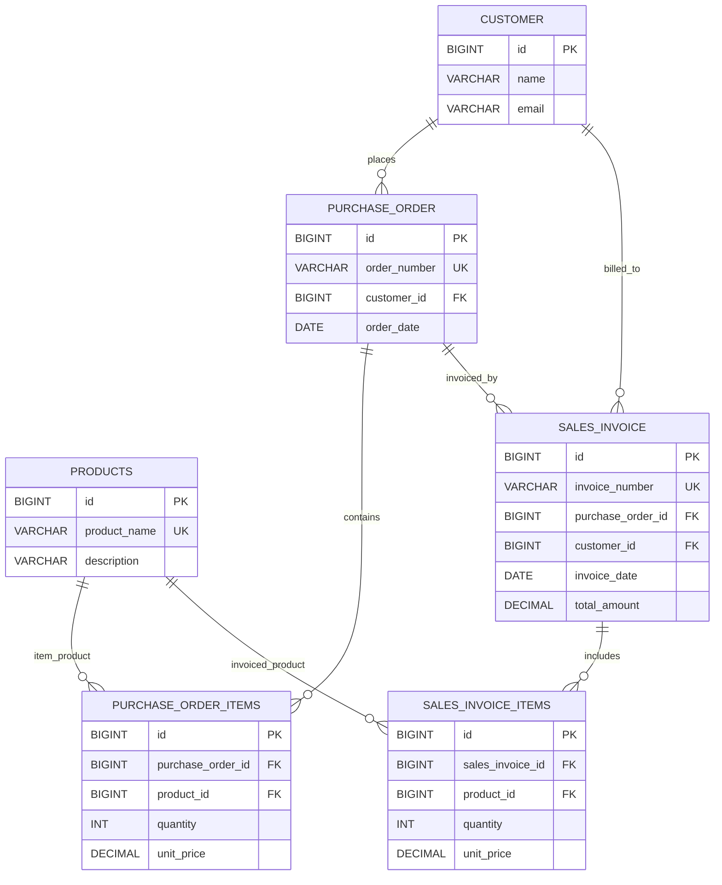

```mermaid
erDiagram
    CUSTOMER {
        BIGINT id PK
        VARCHAR name
        VARCHAR email
    }

    PURCHASE_ORDER {
        BIGINT id PK
        VARCHAR order_number UK
        BIGINT customer_id FK
        DATE order_date
    }

    PRODUCTS {
        BIGINT id PK
        VARCHAR product_name UK
        VARCHAR description
    }

    PURCHASE_ORDER_ITEMS {
        BIGINT id PK
        BIGINT purchase_order_id FK
        BIGINT product_id FK
        INT quantity
        DECIMAL unit_price
    }

    SALES_INVOICE {
        BIGINT id PK
        VARCHAR invoice_number UK
        BIGINT purchase_order_id FK
        BIGINT customer_id FK
        DATE invoice_date
        DECIMAL total_amount
    }

    SALES_INVOICE_ITEMS {
        BIGINT id PK
        BIGINT sales_invoice_id FK
        BIGINT product_id FK
        INT quantity
        DECIMAL unit_price
    }

    CUSTOMER ||--o{ PURCHASE_ORDER : places
    CUSTOMER ||--o{ SALES_INVOICE : billed_to

    PURCHASE_ORDER ||--o{ PURCHASE_ORDER_ITEMS : contains
    PRODUCTS ||--o{ PURCHASE_ORDER_ITEMS : item_product

    PURCHASE_ORDER ||--o{ SALES_INVOICE : invoiced_by
    SALES_INVOICE ||--o{ SALES_INVOICE_ITEMS : includes
    PRODUCTS ||--o{ SALES_INVOICE_ITEMS : invoiced_product
```